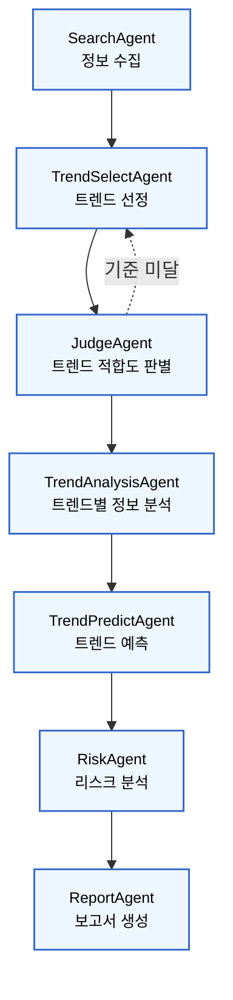

# TITLE
미래 기술 트랜드 분석
개요 : AI를 포함한 미래 기술을 분석하고, 향후 5년 이내 기업에서 관심있게 봐야할 AI 트랜드 예측 보고서 생성하는 시스템

## Overview

- Objective : 기업 전략 수집을 위한 AI 트랜드 분석 및 예측 보고서 자동화
- Methods : 웹 기반 트랜드 키워드 수집, 선정 지표 기반 평가, 시사점 도출 및 보고서 생성
- Tools : Langchain 기반 에이전트 설계, GPT-4o 기반 요약 및 분석

## 보고서 정의  
보고서 목차
1. SUMMARY 
    - 주요 AI 트랜드 요약
    - 기업 관점 핵심 시사점
2. 트랜드 분석
    2.1 트랜드 정의 및 등장 배경  
    2.2 주요 기술 및 사례  
    2.3 기업 및 산업 동향  
    - 주요 산업에서의 적용 현황 및 시장 규모 추이  
    2.4 산업별 적용 흐름 
    - 산업별 기술 도입 단계
    - 산업별 대표 사례 및 적용 과제  
    2.5 트랜드 전망 : 향후 5년간의 기술 발전과 시장 변화 예측  
- 기업 전략 인사이트
    - 비즈니스 기회 요인
    - 리스크 및 대응 전략
    - 기업 적용을 위한 제안
- 참고 문헌
- APPENDIX
  - 트랜드 선정 지표 세부 내용
     - 관심도/주목도
     - 사회적 영향력
     - 성장 가능성
     - 기업 적용성

## Graph

## Agent
- SearchAgent : 최근 1~2년간 주요 연구 결과 및 뉴스를 출처별로 수집
- TrendSelectAgent : 트랜드 선별
- JudgeAgent : 평가 지표에 따른 트랜드 적합도 판별
- TechSumAgent : 선정된 트랜드별 정보 분석
- TrendPredictAgent : 각 기술 트랜드의 발전 방향 및 시장 적용 가능성 예측
- RiskAgent : 예상 트랜드에 따른 리스크 및 기회 분석 요인 분석
- ReportAgent : 트랜드 분석 결과를 정리한 보고서 작성

## Tool

## Contributors 
- 송재령
