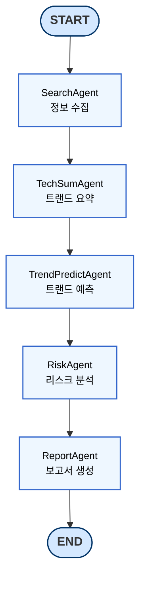

# TITLE
미래 기술 트랜드 분석
개요 : AI를 포함한 미래 기술을 분석하고, 향후 5년 이내 기업에서 관심있게 봐야할 AI 트랜드 예측 보고서 생성하는 시스템

## Overview

- Objective : 기업 전략 수집을 위한 AI 트랜드 분석 및 예측 보고서 자동화
- Methods : 웹 기반 트랜드 키워드 수집, 선정 지표 기반 평가, 시사점 도출 및 보고서 생성
- Tools : Langchain 기반 에이전트 설계, GPT-4o 기반 요약 및 분석

## 보고서 정의  
보고서 목차
- SUMMARY 
    - 주요 AI 트랜드 요약, 기업 관점 핵심 시사점
- 트랜드 분석
    - 트랜드 정의 및 등장 배경
    - 주요 기술/ 사례/ 기업 동향
    - 산업별 적용 흐름
    - 사회적 반응
    - 기업 관점의 전략 제안
- 트랜드 선정 지표
    - 관심도/주목도
    - 사회적 영향력
    - 성장 가능성
    - 기업 적용성
- 참고 문헌
- APPENDIX

## Graph

## Agent
- SearchAgent : 최근 1~2년간 주요 연구 결과 및 뉴스를 출처별로 수집
- TechSumAgent : 수집된 정보를 바탕으로 주요 기술별 트랜드 요약
- TrendPredictAgent : 각 기술 트랜드의 발전 방향 및 시장 적용 가능성 예측
- RiskAgent : 예상 트랜드에 따른 리스크 및 기회 분석 요인 분석
- ReportAgent : 트랜드 분석 결과를 정리한 보고서 작성

## Tool

## Contributors 
- 송재령
