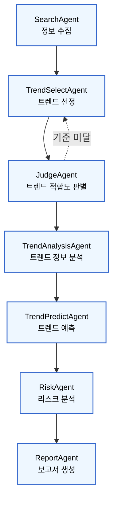

# TITLE
미래 기술 트렌드 분석
개요 : AI를 포함한 미래 기술을 분석하고, 향후 5년 이내 기업에서 관심있게 봐야할 AI 트렌드 예측 보고서 생성하는 시스템

## Overview

- Objective : 기업 전략 수집을 위한 AI 트렌드 분석 및 예측 보고서 자동화
- Methods : 웹 기반 트렌드 키워드 수집, 선정 지표 기반 평가, 시사점 도출 및 보고서 생성
- Tools : Langchain 기반 에이전트 설계, GPT-4o 기반 요약 및 분석

## Directory Structure
AI_SERVICE_MINIPROJECT/  
├── agents/ # 주요 에이전트 모듈  
│ ├── init.py  
│ ├── search_agent.py # Tavily API를 통해 트렌드 후보   
│ ├── trend_select_agent.py # 주요 트렌드 선택 로직  
│ ├── judge_agent.py # 기술 성숙도 및 성장성 평가  
│ ├── trend_analysis_agent.py # 산업별 적용 및 기술적 특성 분석  
│ ├── trend_predict_agent.py # 향후 3~5년간 기술 발전 방향 예측  
│ ├── risk_agent.py # 리스크 및 기회 요인 분석  
│ ├── report_agent.py # PDF 보고서 자동 생성  
│ └── state_schema.py # 전체 워크플로우 state 정의  
│  
├── utils/ # 보조 유틸리티  
│ ├── data_cleaner.py # 텍스트 전처리 및 정제  
│ └── init.py  
│  
├── reports/ # 자동 생성된 분석 보고서  
│  
├── fonts/ # PDF 렌더링용 폰트  
│  
├── .env # API 키 및 환경 변수  
├── main.py # 실행 엔트리 포인트  
├── gitignore  
├── requirements.txt # 의존성 목록  
└── README.md # 프로젝트 설명서  

## Tech Stack
| 구분 | 사용 기술 |  
|------|------------|  
| **LLM** | OpenAI `gpt-4o-mini` |  
| **프레임워크** | [LangGraph](https://python.langchain.com/docs/langgraph), LangChain |  
| **검색** | Tavily API |  
| **PDF 생성** | FPDF / ReportLab |  
| **환경 변수 관리** | python-dotenv |  
| **데이터 처리** | pandas, re, json |  
| **OS/로깅** | logging, pathlib |  

## 보고서 정의  
보고서 목차
1. SUMMARY 
    - 주요 AI 트렌드 요약
    - 기업 관점 핵심 시사점
2. 트렌드 분석  
    2.1 트렌드 정의 및 등장 배경  
    2.2 주요 기술 및 사례  
    2.3 기업 및 산업 동향  
        - 주요 산업에서의 적용 현황 및 시장 규모 추이  
    2.4 산업별 적용 흐름  
        - 산업별 기술 도입 단계  
        - 산업별 대표 사례 및 적용 과제    
    2.5 트렌드 전망 : 향후 5년간의 기술 발전과 시장 변화 예측  
3. 기업 전략 인사이트   
    3.1 비즈니스 기회 요인  
    3.2 리스크 및 대응 전략  
    3.3 기업 적용을 위한 제안  
- 참고 문헌
- APPENDIX
  - 트렌드 선정 지표 세부 내용
    - 기술적 성숙도 
    - 미래 성장성
    - 산업 적용성
    - 사회적 영향력
    - 혁신성 및 차별성

## Graph

## Agent
- SearchAgent : 최근 1~2년간 주요 연구 결과 및 뉴스를 출처별로 수집
- TrendSelectAgent : 트렌드 선별 
    - 트렌드 키워드 추출 
    - 최근 2년 내 급부상 정도, 향후 5년 성장 가능성, 산업 적용성을 기준으로 정렬
- JudgeAgent : 평가 지표에 따른 트렌드 적합도 판별
- TrendAnalysisAgent : 선정된 트렌드 정보 분석
- TrendPredictAgent : 각 기술 트렌드의 발전 방향 및 시장 적용 가능성 예측
- RiskAgent : 예상 트렌드에 따른 리스크 및 기회 분석 요인 분석
- ReportAgent : 트렌드 분석 결과를 정리한 보고서 작성

## Tool

## Contributors 
- 송재령
